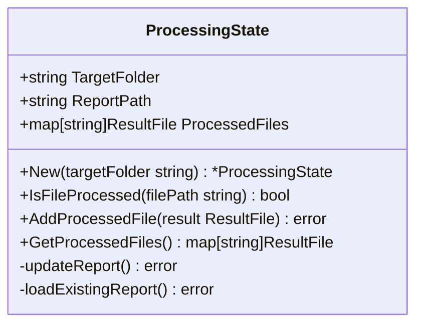

# Incremental Reporting and Resumable Processing Plan

## Problem Statement

The current application has two issues:
1. When processing is interrupted, all classification work is lost as the report is only written at the end
2. There's no way to resume from a previous point, requiring reprocessing of all files

## Architecture Overview

To solve these issues, we'll implement a state management system that:
1. Updates the report incrementally after each file is processed
2. Tracks which files have been processed
3. Allows skipping already-processed files when resuming

## Implementation Plan

### 1. Create a New State Package

We'll create a new package called `state` to handle processing state and incremental reporting:



### 2. Detailed Implementation Steps

#### 2.1 Create the State Package Structure

```
state/
  |- state.go         // Main state management functionality
  |- report_parser.go // Logic to parse existing reports
  |- report_writer.go // Logic to write incremental updates
```

#### 2.2 Implement Core State Management

The state manager will:
- Initialize with the target folder
- Check for an existing report and load its state if available
- Provide methods to check if a file has been processed
- Add newly processed files and update the report

#### 2.3 Implement Report Parsing

We'll need to parse existing reports to:
- Extract file paths and their classifications
- Reconstruct the processing state
- Handle potential errors or inconsistencies

#### 2.4 Implement Incremental Report Updates

After each file is processed:
- Update the in-memory state
- Regenerate the complete report
- Write it atomically to prevent corruption

#### 2.5 Update CLI Workflow

Modify the main CLI workflow to:
- Initialize the state manager early
- Check if each file has already been processed
- Skip already processed files
- Update the state after each file is processed

### 3. Code Changes

#### 3.1 New State Package

**state/state.go**:
```go
package state

import (
    "fmt"
    "os"
    "path/filepath"
    
    "ratemykb/output"
)

// ProcessingState manages the state of file processing
type ProcessingState struct {
    TargetFolder  string
    ReportPath    string
    ProcessedFiles map[string]output.ResultFile
}

// New creates a new ProcessingState and loads existing state if a report exists
func New(targetFolder string) (*ProcessingState, error) {
    ps := &ProcessingState{
        TargetFolder:  targetFolder,
        ReportPath:    filepath.Join(targetFolder, "vault-quality-report.md"),
        ProcessedFiles: make(map[string]output.ResultFile),
    }
    
    // Load existing state from report if it exists
    if _, err := os.Stat(ps.ReportPath); err == nil {
        if err := ps.loadExistingReport(); err != nil {
            return nil, fmt.Errorf("failed to load existing report: %w", err)
        }
        fmt.Printf("Found existing report with %d processed files\n", len(ps.ProcessedFiles))
    }
    
    return ps, nil
}

// IsFileProcessed checks if a file has already been processed
func (ps *ProcessingState) IsFileProcessed(filePath string) bool {
    _, exists := ps.ProcessedFiles[filePath]
    return exists
}

// AddProcessedFile adds a processed file to the state and updates the report
func (ps *ProcessingState) AddProcessedFile(file output.ResultFile) error {
    // Add to processed files map
    ps.ProcessedFiles[file.Path] = file
    
    // Update the report
    return ps.updateReport()
}

// GetProcessedFiles returns the map of processed files
func (ps *ProcessingState) GetProcessedFiles() map[string]output.ResultFile {
    return ps.ProcessedFiles
}
```

**state/report_parser.go**:
```go
package state

import (
    "bufio"
    "fmt"
    "os"
    "path/filepath"
    "regexp"
    "strings"
    
    "ratemykb/classification"
    "ratemykb/output"
    "ratemykb/scanner"
)

// loadExistingReport reads the existing report and populates the processed files map
func (ps *ProcessingState) loadExistingReport() error {
    file, err := os.Open(ps.ReportPath)
    if err != nil {
        return fmt.Errorf("failed to open report: %w", err)
    }
    defer file.Close()
    
    // Parse the report to extract processed files
    scanner := bufio.NewScanner(file)
    currentSection := ""
    obsidianLinkPattern := regexp.MustCompile(`\[\[([^\]]+)\]\]`)
    
    for scanner.Scan() {
        line := scanner.Text()
        
        // Identify sections
        if strings.HasPrefix(line, "## ") {
            currentSection = strings.TrimPrefix(line, "## ")
            continue
        }
        
        // Process file entries in each section
        if strings.HasPrefix(line, "- [[") && currentSection != "" {
            matches := obsidianLinkPattern.FindStringSubmatch(line)
            if len(matches) >= 2 {
                obsidianLink := matches[1]
                
                // Convert Obsidian link back to file path
                filePath := ps.convertObsidianLinkToPath(obsidianLink)
                
                // Determine classification based on section
                var classification classification.Classification
                var status scanner.FileStatus
                
                switch {
                case currentSection == "Empty Files":
                    classification = classification.Classification("Empty")
                    status = scanner.StatusEmpty
                case currentSection == "Files with Frontmatter Only":
                    classification = classification.Classification("Low quality")
                    status = scanner.StatusFrontmatterOnly
                case strings.Contains(currentSection, "Low quality"):
                    classification = classification.Classification("Low quality")
                    status = scanner.StatusNeedsReview
                case strings.Contains(currentSection, "Good enough"):
                    classification = classification.Classification("Good enough")
                    status = scanner.StatusNeedsReview
                default:
                    // For sections we don't recognize
                    classification = classification.Classification(currentSection)
                    status = scanner.StatusNeedsReview
                }
                
                // Add to processed files
                ps.ProcessedFiles[filePath] = output.ResultFile{
                    Path:           filePath,
                    Status:         status,
                    Classification: classification,
                }
            }
        }
    }
    
    return scanner.Err()
}

// convertObsidianLinkToPath converts an Obsidian link back to a file path
func (ps *ProcessingState) convertObsidianLinkToPath(obsidianLink string) string {
    // Convert forward slashes to path separators
    pathWithoutExt := strings.ReplaceAll(obsidianLink, "/", string(filepath.Separator))
    
    // Add file extension and target folder path
    return filepath.Join(ps.TargetFolder, pathWithoutExt + ".md")
}
```

**state/report_writer.go**:
```go
package state

import (
    "fmt"
    "os"
    "path/filepath"
    "sort"
    "strings"
    "time"
    
    "ratemykb/output"
    "ratemykb/scanner"
)

// updateReport regenerates the report with all processed files
func (ps *ProcessingState) updateReport() error {
    // Create a temporary file for writing
    tempFile := ps.ReportPath + ".tmp"
    file, err := os.Create(tempFile)
    if err != nil {
        return fmt.Errorf("failed to create temp report file: %w", err)
    }
    
    // Generate report content
    var content strings.Builder
    
    // Add header
    content.WriteString("# Vault Quality Report\n\n")
    content.WriteString(fmt.Sprintf("Generated on: %s\n\n", time.Now().Format("2006-01-02 15:04:05")))
    content.WriteString(fmt.Sprintf("Target folder: `%s`\n\n", ps.TargetFolder))
    
    // Categorize files
    var emptyFiles, frontmatterOnlyFiles []output.ResultFile
    classificationMap := make(map[string][]output.ResultFile)
    
    for _, file := range ps.ProcessedFiles {
        if file.Status == scanner.StatusEmpty {
            emptyFiles = append(emptyFiles, file)
        } else if file.Status == scanner.StatusFrontmatterOnly {
            frontmatterOnlyFiles = append(frontmatterOnlyFiles, file)
        } else if file.Classification != "" {
            classStr := string(file.Classification)
            classificationMap[classStr] = append(classificationMap[classStr], file)
        }
    }
    
    // Add statistics
    content.WriteString("## Statistics\n\n")
    content.WriteString(fmt.Sprintf("- Total files processed: %d\n", len(ps.ProcessedFiles)))
    content.WriteString(fmt.Sprintf("- Empty files: %d\n", len(emptyFiles)))
    content.WriteString(fmt.Sprintf("- Files with frontmatter only: %d\n", len(frontmatterOnlyFiles)))
    
    // Add statistics for each classification type
    for classType, classFiles := range classificationMap {
        content.WriteString(fmt.Sprintf("- %s files: %d\n", classType, len(classFiles)))
    }
    content.WriteString("\n")
    
    // Add empty files section
    content.WriteString("## Empty Files\n\n")
    if len(emptyFiles) == 0 {
        content.WriteString("No empty files found.\n\n")
    } else {
        // Sort for consistent output
        sort.Slice(emptyFiles, func(i, j int) bool {
            return emptyFiles[i].Path < emptyFiles[j].Path
        })
        
        for _, file := range emptyFiles {
            link := formatObsidianLink(ps.TargetFolder, file.Path)
            content.WriteString(fmt.Sprintf("- %s\n", link))
        }
        content.WriteString("\n")
    }
    
    // Add frontmatter-only files section
    content.WriteString("## Files with Frontmatter Only\n\n")
    if len(frontmatterOnlyFiles) == 0 {
        content.WriteString("No files with frontmatter only found.\n\n")
    } else {
        // Sort for consistent output
        sort.Slice(frontmatterOnlyFiles, func(i, j int) bool {
            return frontmatterOnlyFiles[i].Path < frontmatterOnlyFiles[j].Path
        })
        
        for _, file := range frontmatterOnlyFiles {
            link := formatObsidianLink(ps.TargetFolder, file.Path)
            content.WriteString(fmt.Sprintf("- %s\n", link))
        }
        content.WriteString("\n")
    }
    
    // Add sections for each classification type
    var classTypes []string
    for classType := range classificationMap {
        classTypes = append(classTypes, classType)
    }
    sort.Strings(classTypes)
    
    for _, classType := range classTypes {
        classFiles := classificationMap[classType]
        content.WriteString(fmt.Sprintf("## %s Files\n\n", classType))
        if len(classFiles) == 0 {
            content.WriteString(fmt.Sprintf("No %s files found.\n\n", strings.ToLower(classType)))
        } else {
            // Sort for consistent output
            sort.Slice(classFiles, func(i, j int) bool {
                return classFiles[i].Path < classFiles[j].Path
            })
            
            for _, file := range classFiles {
                link := formatObsidianLink(ps.TargetFolder, file.Path)
                content.WriteString(fmt.Sprintf("- %s\n", link))
            }
            content.WriteString("\n")
        }
    }
    
    // Write content to temporary file
    _, err = file.WriteString(content.String())
    if err != nil {
        file.Close()
        os.Remove(tempFile)
        return fmt.Errorf("failed to write to temp report: %w", err)
    }
    
    // Close the file
    if err := file.Close(); err != nil {
        os.Remove(tempFile)
        return fmt.Errorf("failed to close temp report file: %w", err)
    }
    
    // Atomically replace the existing report
    if err := os.Rename(tempFile, ps.ReportPath); err != nil {
        os.Remove(tempFile)
        return fmt.Errorf("failed to replace report: %w", err)
    }
    
    return nil
}

// formatObsidianLink converts a file path to an Obsidian link format [[link-to-page]]
func formatObsidianLink(targetFolder, filePath string) string {
    // Make path relative to target folder
    relPath, err := filepath.Rel(targetFolder, filePath)
    if err != nil {
        // Fallback to base name if relative path fails
        relPath = filepath.Base(filePath)
    }
    
    // Remove file extension
    baseName := strings.TrimSuffix(relPath, filepath.Ext(relPath))
    
    // Convert path separators to forward slashes for Obsidian format
    baseName = strings.ReplaceAll(baseName, string(filepath.Separator), "/")
    
    // Format as Obsidian link [[link-to-page]]
    return fmt.Sprintf("[[%s]]", baseName)
}
```

#### 3.2 Modified CLI Workflow

**cli/cli.go** (changes to existing file):
```go
// Add import for state package
import (
    "ratemykb/state"
    // ... existing imports
)

// Modify the RunE function:
RunE: func(cmd *cobra.Command, args []string) error {
    // ... existing code for loading config, initializing scanner, etc.
    
    // Initialize state manager
    stateManager, err := state.New(targetFolder)
    if err != nil {
        return fmt.Errorf("failed to initialize state manager: %w", err)
    }
    
    // ... existing code for scanning directory
    
    // Get total number of files to process
    totalFiles := len(files)
    totalAlreadyProcessed := 0
    fmt.Printf("Found %d Markdown files\n", totalFiles)
    
    // Helper function to show progress
    showProgress := func(i int, action, details string) {
        filesProcessed := i + 1
        percentComplete := float64(filesProcessed) / float64(totalFiles) * 100
        fmt.Printf("[%d/%d - %.1f%%] %s %s\n", filesProcessed, totalFiles, percentComplete, action, details)
    }
    
    // Process each file
    for i, file := range files {
        // Check if file has already been processed
        if stateManager.IsFileProcessed(file.Path) {
            totalAlreadyProcessed++
            showProgress(i, "Skipping (already processed)", file.Path)
            continue
        }
        
        // Create a result file with default classification
        result := output.ResultFile{
            Path:           file.Path,
            Status:         file.Status,
            Classification: classification.Classification("Unknown"),
        }
        
        // Classify files that need review
        if file.Status == scanner.StatusNeedsReview {
            // ... existing classification code
            showProgress(i, "Classifying", file.Path)
            
            // Read file content and classify it
            content, err := scanner.ReadFileContent(file.Path)
            if err != nil {
                fmt.Printf("Warning: Could not read file %s: %v\n", file.Path, err)
                continue
            }
            
            result.Classification, err = classifier.ClassifyContent(content)
            if err != nil {
                fmt.Printf("Warning: Could not classify file %s: %v\n", file.Path, err)
                continue
            }
            
            // Print the classification result
            fmt.Printf("Classification result: %s\n", result.Classification)
            
        } else if file.Status == scanner.StatusEmpty {
            // Map scanner status to classification
            result.Classification = classification.Classification("Empty")
            showProgress(i, "Skipping classification for", file.Path+" (Empty)")
        } else if file.Status == scanner.StatusFrontmatterOnly {
            // Frontmatter-only files are considered low quality
            result.Classification = classification.Classification("Low quality")
            showProgress(i, "Skipping classification for", file.Path+" (Frontmatter-only)")
        } else if file.Status == scanner.StatusExcluded {
            // Show progress for excluded files
            showProgress(i, "Skipping", file.Path+" (Excluded)")
            continue // Don't add excluded files to the report
        }
        
        // Add processed file to state and update report
        if err := stateManager.AddProcessedFile(result); err != nil {
            fmt.Printf("Warning: Could not update report for %s: %v\n", file.Path, err)
        }
    }
    
    fmt.Printf("Processing complete: %d new files processed, %d already processed, %d total\n", 
        len(stateManager.GetProcessedFiles()) - totalAlreadyProcessed, 
        totalAlreadyProcessed,
        len(stateManager.GetProcessedFiles()))
    
    // No need to generate a final report as it's been updated incrementally
    fmt.Printf("Report available at %s/vault-quality-report.md\n", targetFolder)
    return nil
}
```

### 4. Testing Strategy

#### 4.1 Unit Tests

Create tests for the state package:

**state/state_test.go**:
- Test creating a new state
- Test checking if a file is processed
- Test adding processed files

**state/report_parser_test.go**:
- Test parsing an existing report
- Test handling malformed reports
- Test path conversion between file paths and Obsidian links

#### 4.2 Integration Tests

Modify the existing integration test or create a new one:
- Test the entire workflow with interruptions
- Test resuming from a previous state

### 5. Implementation Timeline

1. Create `state` package with basic structure (1 day)
2. Implement report parsing and writing (1-2 days)
3. Update CLI workflow (1 day)
4. Add tests (1-2 days)
5. Documentation and cleanup (1 day)

Total estimated time: 5-7 days

## Benefits and Advantages

1. **Resilience to Interruptions**: Work is preserved incrementally
2. **Efficiency**: Avoids redundant processing when resumed
3. **Maintainability**: Clear separation of concerns with state management
4. **Compatibility**: Maintains the same report format
5. **No External Dependencies**: Uses the file system for state persistence

## Architectural Diagram

```mermaid
graph TD
    CLI[CLI] --> Scanner[Scanner]
    CLI --> StateManager[State Manager]
    CLI --> Classifier[Classifier]
    StateManager --> Report[Report File]
    StateManager --> ReportParser[Report Parser]
    StateManager --> ReportWriter[Report Writer]
    
    subgraph Processing Flow
        Scanner -->|File List| CLI
        CLI -->|Check if Processed| StateManager
        StateManager -->|Not Processed| Classifier
        Classifier -->|Classification Result| CLI
        CLI -->|Add Processed File| StateManager
        StateManager -->|Update| Report
    end